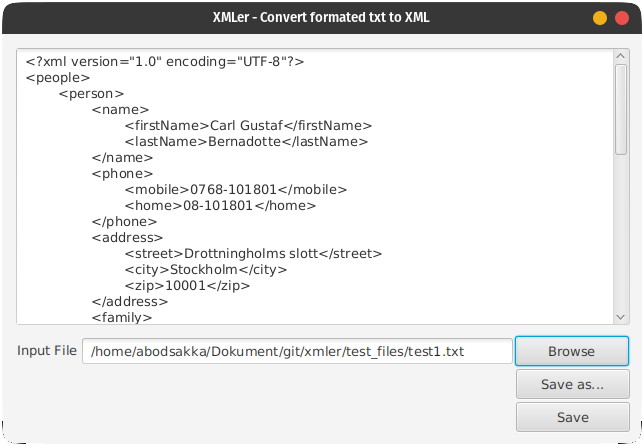

# Xmler
Xmler is a simple tool to convert formated text into a XML file.



## Usage

You can download the latest version of the application and follow the download instructions [here](https://github.com/abodsakah/xmler/releaseshttps://github.com/abodsakah/xmler/releases).

The format of the file to be used is as follows:
```
P|First name|Last name
T|Mobile number|landline number
A|Street|City|Zip code
F|Name|Birth year
```

The codes in the beginning of each line are as follows:
```
P - Person
T - Telephone
A - Address
F - Family
```

The `Person` code could be followed by a `T`, `A`, or `F` code.

And the `Family` code could be followed by a `T` or `A` code.

### Example

```
P|Carl Gustaf|Bernadotte
T|0768-101801|08-101801
A|Drottningholms slott|Stockholm|10001
F|Victoria|1977
A|Haga Slott|Stockholm|10002
F|Carl Philip|1979
T|0768-101802|08-101802
P|Barack|Obama
A|1600 Pennsylvania Avenue|Washington, D.C
```

Will produce the following XML file:
```xml
<?xml version="1.0" encoding="UTF-8"?>
<people>
	<person>
		<name>
			<firstName>Carl Gustaf</firstName>
			<lastName>Bernadotte</lastName>
		</name>
		<phone>
			<mobile>0768-101801</mobile>
			<home>08-101801</home>
		</phone>
		<address>
			<street>Drottningholms slott</street>
			<city>Stockholm</city>
			<zip>10001</zip>
		</address>
		<family>
			<name>Victoria</name>
			<born>1977</born>
			<address>
				<street>Haga Slott</street>
				<city>Stockholm</city>
				<zip>10002</zip>
			</address>
		</family>
		<family>
			<name>Carl Philip</name>
			<born>1979</born>
			<phone>
				<mobile>0768-101802</mobile>
				<home>08-101802</home>
			</phone>
		</family>
	</person>
	<person>
		<name>
			<firstName>Barack</firstName>
			<lastName>Obama</lastName>
		</name>
		<address>
			<street>1600 Pennsylvania Avenue</street>
			<city>Washington, D.C</city>
		</address>
	</person>
</people>
```

## Building the application
### Requirements
- [JDK 11](https://www.oracle.com/java/technologies/javase-jdk11-downloads.html)
- [Maven](https://maven.apache.org/download.cgi)

### Build
Start by cloning the repository:
```shell
$ git clone https://github.com/abodsakah/xmler.git
```

You can run the application by running
```shell
$ mvn javafx:run -f "./pom.xml" 
```

## License
This project is licensed under the [MIT license](https://opensource.org/licenses/MIT)